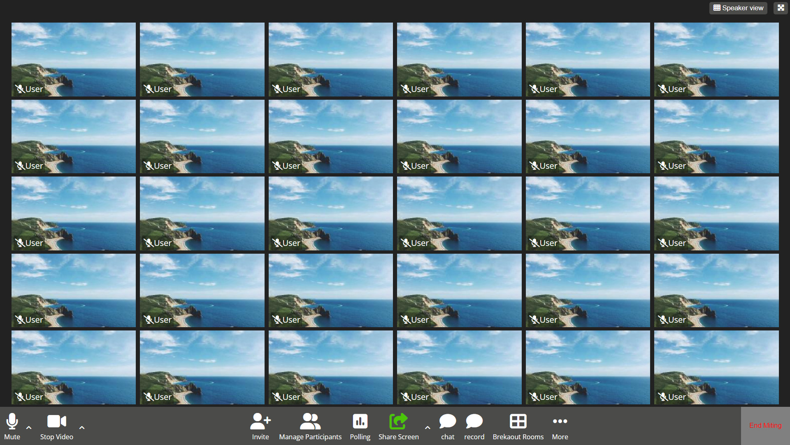

# Zoom - Replica web-page

**Initial commit**: 09/02/23

**Tecnologie:** HTML, CSS, Flex e grid

**Info**: 🧑🏻‍💻 Here is my replica of Zoom, one of the first projects created with Boolean.
In this exercise, to arrange the user icons in an orderly manner, I recreated the functionality of a grid using Flex.

## Schreenshot

